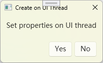

---
tags:
    - WPF
    - Frontend
    - Customizing
icon: fontawesome/solid/puzzle-piece
---

## MessageBox



1. 创建一个 Window
2. 窗口设置
    - `ResizeMode`: 用于定义右上角的窗体按钮
    - `ShowInTaskbar`：不在系统任务栏显示
    - `WindowStyle`：窗口风格，默认 `SingleBorderWindow`
3. 依赖属性
    - `ButtonCommandProperty`：只读的依赖属性，用于处理按钮点击后的结果
    - `ConfirmText`、`RefuseText`、`CancelText`：分别对应含义为肯定的、否定的和取消的按钮，根据相应属性是否有内容来决定是否显示相应的按钮
    - `Title`、`Caption`：需要显示的信息

> 遇到过一个问题，一开始直接使用控件继承来的 `Content` 属性，但是它实际上是 `Window` 下的默认属性，会导致窗口中的内容被赋值的字符串替代

## ShowDialogAsync

使用 `TaskCompletionSource` 来将同步的方法转换为异步，本质上是将手动编写回调方法的操作交给了编译器：

```C#
protected TaskCompletionSource<MessageBoxResult>? TaskCompletionSource { get; set; }
```

`base.ShowDialog()` 仍然需要在主线程：

```C#
    public async Task<MessageBoxResult> ShowDialogAsync(
        CancellationToken cancellationToken = default
    )
    {
        TaskCompletionSource = new TaskCompletionSource<MessageBoxResult>();

        CancellationTokenRegistration tokenRegistration = cancellationToken.Register(
            o => TaskCompletionSource.TrySetCanceled((CancellationToken)o!),
            cancellationToken
        );

        try
        {
            base.ShowDialog();

            return await TaskCompletionSource.Task;
        }
        finally
        {
#if NET6_0_OR_GREATER
            await tokenRegistration.DisposeAsync();
#else
            tokenRegistration.Dispose();
#endif
        }
    }
```

在离开窗口时异步地设置结果：

```C#
private void OnButtonClick(string buttonName)
{
    var result = buttonName switch
    {
        CONFIRM => MessageBoxResult.Yes,
        REFUSE => MessageBoxResult.No,
        CANCEL => MessageBoxResult.Cancel,
        _ => throw new ApplicationException(),
    };

    _ = TaskCompletionSource?.TrySetResult(result);

    base.Close();
}

protected override void OnClosing(CancelEventArgs e)
{
    base.OnClosing(e);

    if (e.Cancel)
    {
        return;
    }

    _ = TaskCompletionSource?.TrySetResult(MessageBoxResult.Cancel);
}
```

## 使用

属性的设置及方法的调用都需要在主线程：

```C#
[RelayCommand]
private async Task ShowOnUiThreadAndContinueOnNonUiThread()
{
    var result = await System.Windows.Application.Current.Dispatcher.Invoke(() =>
    {
        var box = new MessageBox()
        {
            Title = "Create on UI Thread",
            Caption = "Set properties on UI thread",
            ConfirmText = "Yes",
            RefuseText = "No",
            WindowStartupLocation = System.Windows.WindowStartupLocation.CenterScreen,
        };

        var t = box.ShowDialogAsync();

        return t;
    });

    await Task.Run(() =>
    {
        if (result == System.Windows.MessageBoxResult.Yes)
        {
            Messenger.Send("I'm OK here.", nameof(MainViewModel));
        }
        else if (result == System.Windows.MessageBoxResult.No)
        {
            Messenger.Send("Cancelled.", nameof(MainViewModel));
        }
    });
}
```

## 理解

编译器对 `await` 的操作是将其后的代码片段转换成类似 `Task.Continuation` 的逻辑，本质上也是一种类似回调的逻辑，只不过是隐式由编译器实现的。

`base.ShowDialog` -> 窗口关闭时返回 -> 在 `OnClosing` 或 `OnButtonClick` 中设置结果 -> `TaskCompletionSource.Task get` -> `ShowDialogAsync` 结束返回

## 代码

[Github: CustomizedMessageBox](https://github.com/orrest/Tests/tree/master/Tests.Wpf/CustomizedMessageBox)