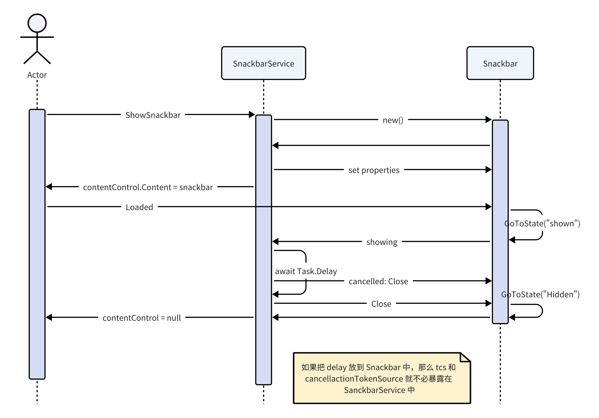

---
tags:
    - WPF
    - Frontend
    - Customizing
icon: fontawesome/solid/puzzle-piece
---

## Usage

1. 在应用所需显示 snackbar 的位置放置一个 `ContentControl` 控件作为容器（在 WPF-UI 中，这个容器是 `SnackbarPresenter`）；
2. 在视图后台代码里注入 `SnackbarService`，然后把这个容器的引用传给 snackbarService；
3. 在所需的地方注入 `SnackbarService` 调用 `Show` 方法；

## SnackbarService

基本思路来自于 WPF-UI，不过做了一些简化。

实现了一个特性，能够把没来得及显示的消息缓存在队列里，然后依次显示，显示的过程中还可以随时关闭当前正在显示的，也不会影响后续的显示。

```C#
public void Show(string title, string message, InfoLevel infoLevel, TimeSpan timeout)
{
    SnackbarRecord record = PrepareProperties(title, message, infoLevel, timeout);

    Application.Current.Dispatcher.Invoke(async () =>
    {
        queue.Enqueue(record);

        // there's already a snackbar running
        if (queue.Count > 1)
        {
            return;
        }

        while (queue.Count > 0)
        {
            var r = queue.Peek();
            await ShowSnackbar(r);
            queue.Dequeue();
        }
    });
}
```

原理很简单，甚至不需要线程间同步，因为为了设置 UI 组件，需要运行在 UI 线程上。

每次收到一个消息时，加入队列，队列中如果已经有消息，那么直接返回。因为队列中已经有消息意味着已经有一个循环在处理。

出队的时候，显示结束再出队，而不是一开始就出队。


```C#
private async Task ShowSnackbar(SnackbarRecord record)
{
    var snackbar = new Snackbar();
    snackbar.SetCurrentValue(Snackbar.RecordProperty, record);

    if (contentControl is null)
    {
        throw new ApplicationException($"SnackbarService not has snackbar ContentControl set.");
    }

    contentControl.Content = snackbar;
    await snackbar.Show();
    await snackbar.Close();
    contentControl.Content = null;
}
```

`ShowSnackbar` 方法很直接，不过 `Snackbar` 的两个方法值得一提。


## Snackbar

由于不希望额外地再引入资源字典，因此使用了 `UserControl` 的方式来实现 `Snackbar`。

```C#
public Snackbar()
{
    InitializeComponent();
    
    SetValue(CloseButtonCommandProperty, new RelayCommand<object>(_ => cancellationSource.Cancel()));
}
```

在最开始的版本中，我在 `ShowSnackbar` 中创建的 cancellationSource 变量，并通过一个 `Closed` 事件使得内外进行交互；

不过我认为现在这种方式内聚性更好一些。

```C#
public async Task Show()
{
    VisualStateManager.GoToElementState(this, "Shown", true);

    try
    {
        await Task.Delay(Record.Timeout, cancellationSource.Token);
    }
    catch (TaskCanceledException)
    {
        return;
    }
}
```

`Show` 方法是一个异步方法，它做两件事，显示，并等待返回。

这样实现是因为需要显示完之后需要调用关闭方法。

```C#
public async Task Close()
{
    var tcs = new TaskCompletionSource();

    var sb = Hidden.Storyboard;
    sb.Completed += (_, _) =>
    {
        tcs.SetResult();
    };

    VisualStateManager.GoToElementState(this, "Hidden", true);

    cancellationSource.Dispose();

    await tcs.Task;
}
```

`Close` 也是一个异步方法，它在“等待”动画结束。

snackbar 结束（动画也结束）之后，才可以将外面的 contentControl 设为空。

## Ref



*第一个版本的序列图（本文是关于修改后的版本的）*

代码示例在：[Github: orrest/Tests](https://github.com/orrest/Tests)